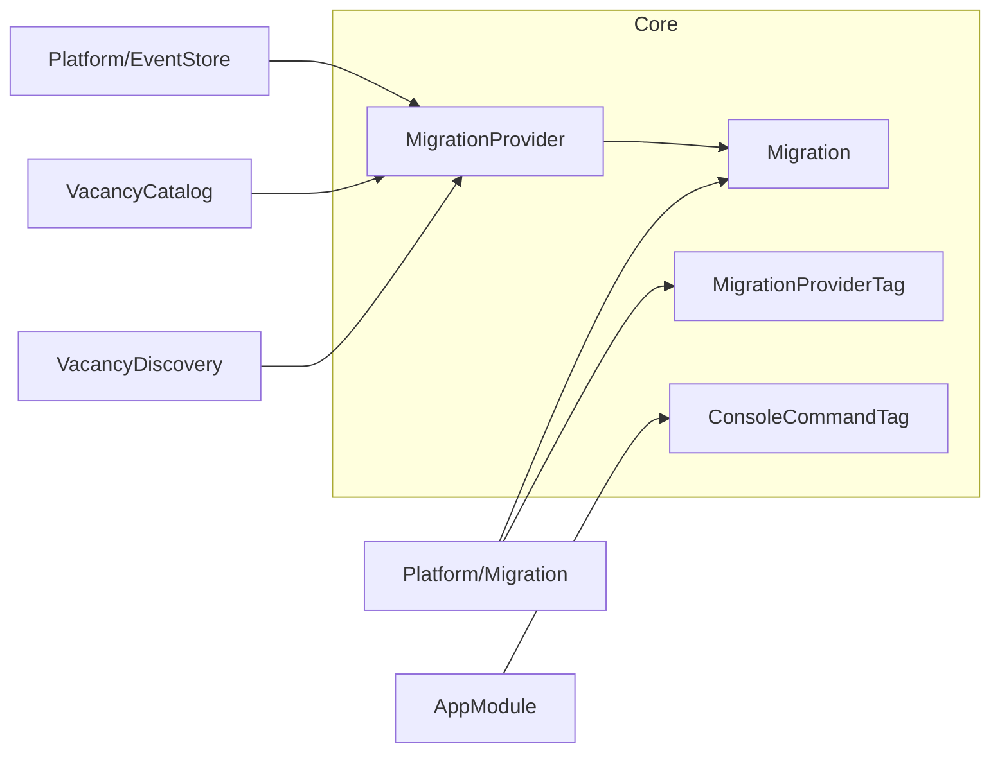

# Модуль Core

`Core` содержит общие контракты, которые используют несколько модулей: типы межмодульного обмена и DI-теги для сборки
приложения. Модуль не содержит бизнес-логики и не зависит от других модулей — зависимости всегда направлены к нему.

## Структура

```text
Core/
├── Domain/
│   ├── Migration.php
│   └── MigrationProvider.php
└── Presentation/
    └── Config/
        ├── ConsoleCommandTag.php
        └── MigrationProviderTag.php
```



## Предметная область

`Migration` -- immutable DTO с публичными полями `version` и `sql`. Конструктор отклоняет пустую версию и пустой
SQL-код через `InvalidArgumentException`.

`MigrationProvider` -- контракт публикации набора миграций методом `migrations(): iterable`.

Оба типа находятся в `Core`, потому что образуют контракт между модулем `Platform\Migration` и всеми модулями,
которые публикуют собственную PostgreSQL-схему. Если разместить их в `Platform\Migration`, возникнет цикл: модуль
`Migration` зависел бы от тега в `Core`, а `Core` -- от типов модуля `Migration`.

Контракт журнала применённых миграций `MigrationStorage` в `Core` не вынесен: он остаётся внутренним делом модуля
`Platform\Migration` и другим модулям не нужен.

## Точки входа

`ConsoleCommandTag` помечает invokable-команды Symfony Console. `AppModule` собирает их через `Dic::taggedList()`
и передаёт в `Application::addCommands()`, поэтому новый модуль может добавить команду без изменения корневого модуля.

`MigrationProviderTag` помечает реализации `MigrationProvider`. `MigrationDi` собирает их через `Dic::taggedList()`.

## Зависимости и конфигурация

Теги зависят от `thesis/dic`, `Domain` не зависит ни от одной внешней библиотеки. Модуль не читает переменные
окружения и не регистрирует собственный DI-модуль: его классы используются напрямую другими модулями.

## Тестирование

`backend/tests/Suite/Core/Domain/MigrationTest.php` проверяет валидацию `Migration`. Теги логики не содержат
и отдельными тестами не покрываются; их сборка проверяется в тестах DI-модулей потребителей.

Независимость `Core` от прикладных модулей проверяет
`backend/tests/Architecture/CleanArchitectureTest::testCoreIndependence`.

## Ограничения

- В `Core` размещаются только контракты, которые нужны нескольким модулям одновременно.
- `Core` не импортирует прикладные модули; допустимы только внутренние зависимости и vendor-библиотеки.
- Слои `Application` и `Infrastructure` в модуле отсутствуют: собственного поведения у `Core` нет.
