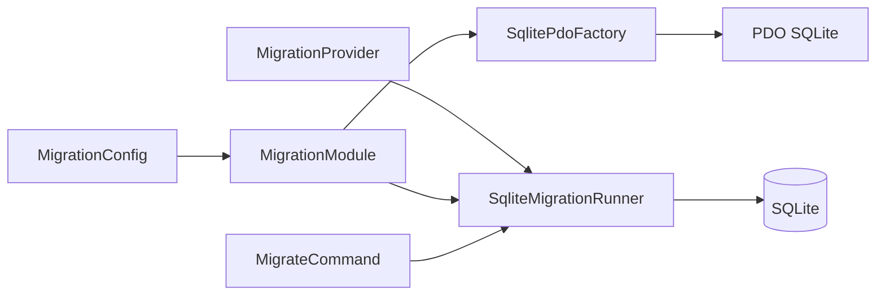

# Модуль Migration

Технический модуль для последовательного применения SQLite-миграций, опубликованных другими модулями. 
Он не содержит бизнес-логики и не определяет прикладную схему базы данных.

## Архитектура и структура модуля

Модуль состоит из трёх слоёв. 
Слоя `Application` нет: `SqliteMigrationRunner` реализует единственный технический сценарий непосредственно в `Infrastructure`.

```text
Migration/
├── Domain/
│   ├── Migration.php
│   └── MigrationProvider.php
├── Infrastructure/
│   ├── SqliteMigrationRunner.php
│   └── SqlitePdoFactory.php
└── Presentation/
    ├── Config/
    │   ├── MigrationConfig.php
    │   └── MigrationModule.php
    └── Console/
        └── MigrateCommand.php
```



`MigrationModule` регистрирует в контейнере `SqlitePdoFactory`, PDO-соединение, `SqliteMigrationRunner` и экспортирует `MigrateCommand`. 
Корневой `AppModule` передаёт в него конфигурацию и ссылки на опубликованные `MigrationProvider`.

## Предметная область

Публичный контракт модуля находится в `Domain`.

- `Migration` - immutable DTO с полями `version` и `sql`. 
   Конструктор отклоняет пустую версию или пустой SQL-код через `InvalidArgumentException`.
- `MigrationProvider` - интерфейс с методом `migrations(): iterable`, который возвращает набор `Migration`.

Модуль, которому нужна собственная SQLite-схема, реализует `MigrationProvider` и публикует его через composition root. 
`Migration` не зависит от реализации мигратора или SQLite.

## Бизнес-логика

Слой `Application` отсутствует, поскольку модуль не реализует пользовательский или бизнес-сценарий. 
Техническую координацию применения миграций выполняет `SqliteMigrationRunner` в `Infrastructure`.

## Точки входа

`backend/bin/migrate.php` создаёт `MigrationConfig` из окружения, собирает `AppModule` и передаёт выполнение `MigrateCommand` через `Dic::run()`.

`MigrateCommand::execute()` запускает `SqliteMigrationRunner::migrate()` и возвращает код завершения `0` при успехе. 
Исключения мигратора не перехватываются командой.

Для запуска предусмотрены команды из корня репозитория:

```bash
make migrate
make remigrate
```

`make migrate` применяет ещё не выполненные миграции. 
`make remigrate` удаляет файл SQLite и его `-shm`/`-wal` файлы, затем запускает мигратор; команда уничтожает все данные в этой базе.

## Инфраструктура

`SqlitePdoFactory` создаёт родительскую директорию файла базы данных при необходимости и открывает PDO-соединение с `PDO::ERRMODE_EXCEPTION`. Невозможность создать директорию приводит к `RuntimeException`.

`SqliteMigrationRunner` выполняет следующий алгоритм:

1. Создаёт техническую таблицу журнала, если её ещё нет:

   ```sql
   CREATE TABLE IF NOT EXISTS schema_migrations (
       version TEXT PRIMARY KEY,
       applied_at TEXT NOT NULL
   )
   ```

2. Получает миграции всех `MigrationProvider`, проверяет уникальность `version` и сортирует их лексикографически по версии.
3. Пропускает версии, уже присутствующие в `schema_migrations`.
4. Для каждой новой миграции в одной транзакции выполняет SQL-код и записывает версию с UTC-временем в формате ISO 8601 (`gmdate('c')`).
5. При любой ошибке в транзакции откатывает её и повторно выбрасывает исключение. Повтор версии среди providers приводит к `RuntimeException` до начала применения.

Мигратор не создаёт прикладные таблицы самостоятельно: их SQL должен поступать от providers.

## Зависимости и конфигурация

`MigrationConfig::fromEnvironment()` читает обязательную переменную `SQLITE_DATABASE_PATH`. 
Её пример задан в [`.env.dist`](../../../.env.dist). 
Пустое или отсутствующее значение приводит к `InvalidArgumentException` до запуска мигратора.

Модуль использует встроенное расширение `ext-pdo` и библиотеку `thesis/dic` для сборки зависимостей. 
Работа с SQLite выполняется через PDO; для запуска также требуется доступный драйвер PDO SQLite.

Единственная межмодульная граница - `MigrationProvider` из собственного `Domain`. 
На текущем этапе `AppModule` передаёт в `MigrationModule` пустой список providers, поэтому запуск команды создаёт 
журнал `schema_migrations`, но не применяет прикладных миграций.

## Тестирование

Тесты находятся в `backend/tests/Suite/Migration/`.

- `Domain/MigrationTest.php` проверяет отклонение пустых версии и SQL-кода.
- `Infrastructure/SqliteMigrationRunnerTest.php` работает с временной SQLite-базой и проверяет порядок и 
  идемпотентность применения, дубликаты версий и откат записи в журнал при ошибке SQL.

## Ограничения

- Модуль поддерживает только применение миграций; механизм отката отсутствует.
- Успешно применённые SQL-миграции не изменяются модулем и не сверяются с их исходным содержимым.
- В текущей сборке не зарегистрирован ни один `MigrationProvider`, поэтому прикладная схема базы данных не создаётся.
