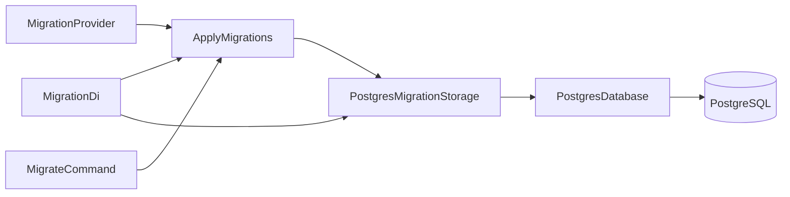

# Модуль Migration

Технический модуль для последовательного применения PostgreSQL-миграций, опубликованных другими модулями. 
Он владеет журналом применённых миграций, но не определяет прикладную схему базы данных.

## Архитектура и структура модуля

```text
Migration/
├── Application/
│   └── UseCase/
│       └── ApplyMigrations.php
├── Domain/
│   └── MigrationStorage.php
├── Infrastructure/
│   └── PostgresMigrationStorage.php
└── Presentation/
    ├── Config/
    │   └── MigrationDi.php
    └── Console/
        └── MigrateCommand.php
```



`MigrationDi` связывает `PostgresMigrationStorage` с Domain-контрактом `MigrationStorage`, собирает providers по
`Core\Presentation\Config\MigrationProviderTag`, создаёт `ApplyMigrations` и экспортирует `MigrateCommand`.

## Предметная область

В `Domain` модуля находится единственный контракт `MigrationStorage`: он создаёт журнал, проверяет наличие версии
и атомарно применяет одну миграцию. Журнал -- внутреннее устройство модуля, другим модулям этот контракт не нужен.

Типы межмодульного обмена принадлежат [модулю `Core`](../../Core/README.md):

- `Core\Domain\Migration` -- immutable DTO с полями `version` и `sql`. Конструктор отклоняет пустую версию
  и пустой SQL-код через `InvalidArgumentException`.
- `Core\Domain\MigrationProvider` -- контракт публикации набора `Migration` методом `migrations(): iterable`.

Они вынесены в `Core`, чтобы модуль `Migration` и публикующие схему модули не зависели друг от друга циклически:
`MigrationDi` зависит от тега в `Core`, а провайдеры -- от контракта в `Core`.

Модуль, которому нужна собственная PostgreSQL-схема, реализует `MigrationProvider` в своей Infrastructure,
экспортирует его из своего DI-модуля и помечает `Core\Presentation\Config\MigrationProviderTag`. Например,
`EventStoreMigrationDi` экспортирует и помечает `EventStoreMigrationProvider`.

## Бизнес-логика

`ApplyMigrations` реализует технический сценарий применения миграций:

1. Инициализирует журнал миграций через `MigrationStorage`.
2. Получает миграции от всех `MigrationProvider`.
3. Проверяет уникальность `version` и выбрасывает `RuntimeException` при повторе.
4. Сортирует миграции лексикографически по версии.
5. Пропускает версии, уже отмеченные как применённые, и передаёт новые в `MigrationStorage::apply()`.

## Точки входа

`backend/bin/app.php migrate` запускает `MigrateCommand` через `AppModule` и `Dic::run()`.

`MigrateCommand::__invoke()` асинхронно запускает `ApplyMigrations::execute()` и возвращает код завершения `0` при успехе.
Ошибки providers или PostgreSQL не перехватываются командой.

## Инфраструктура

`PostgresMigrationStorage` реализует `MigrationStorage` через `Platform\Postgres\Domain\PostgresDatabase`.

- `initialize()` создаёт таблицу `schema_migrations`, если она отсутствует.
- `isApplied()` ищет версию в журнале.
- `apply()` в одной транзакции выполняет SQL миграции и сохраняет её версию. При ошибке транзакция откатывается, 
  а исключение передаётся вызывающему коду.

Журнал имеет следующую структуру:

```sql
CREATE TABLE IF NOT EXISTS schema_migrations (
    version TEXT PRIMARY KEY,
    applied_at TIMESTAMPTZ NOT NULL DEFAULT CURRENT_TIMESTAMP
)
```

## Зависимости и конфигурация

`MigrationDi` принимает ссылку на `PostgresDatabase` из модуля `Platform\Postgres` и собирает providers по тегу.
Сам модуль не читает переменные окружения и не создаёт подключение к PostgreSQL.

Для DI используется `thesis/dic`; выполнение команды использует `amphp/amp`. Настройки подключения к PostgreSQL принадлежат `Platform\Postgres\Presentation\Config\PostgresEnv`.

## Тестирование

Тесты находятся в `backend/tests/Suite/Platform/Migration/`.

- `Application/UseCase/ApplyMigrationsTest.php` проверяет порядок и идемпотентность применения, дубли версий и откат 
  журнала при ошибке SQL на PostgreSQL-адаптере.
- `Presentation/Console/MigrateCommandTest.php` проверяет успешное применение миграций командой через `MigrationDi`.

Валидацию DTO `Migration` проверяет `backend/tests/Suite/Core/Domain/MigrationTest.php`.

## Ограничения

- Поддерживается только применение миграций; механизма отката нет.
- Содержимое уже применённой SQL-миграции не сверяется с её текущим содержимым.
- Порядок определяется лексикографическим сравнением строковых версий; providers должны выбирать версии, сохраняющие 
  требуемый порядок.
