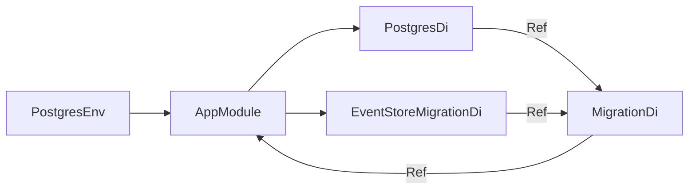

# Composition Root

`MigrateModule` в `MigrateModule.php` является composition root приложения. 
Он не создаёт подключения или адаптеры напрямую: импортирует технические модули и
передаёт между ними только `Ref<T>` exports.

## Текущая композиция

Порядок сборки в `AppModule::configure()`:

1. `PostgresDi` создаёт общий async pool PostgreSQL и экспортирует `Ref<PostgresDatabase>`.
2. `EventStoreMigrationDi` экспортирует `Ref<MigrationProvider>` с миграцией таблицы журнала событий.
3. `MigrationDi` получает оба export и возвращает `Ref<MigrateCommand>`.

`backend/bin/migrate.php` создаёт `PostgresEnv` из окружения, передаёт его
в `MigrateModule` и запускает экспортированный `MigrateCommand`.

## Runtime EventStore

`EventStoreDi` существует, но пока не импортируется корневым модулем:
реализованного runtime-потребителя `EventStore` ещё нет. 
Его миграции уже подключены независимо через `EventStoreMigrationDi`.

`EventBus` уже реализован, но пока не импортируется корневым модулем: первого
runtime-потребителя шины ещё нет. При его добавлении `MigrateModule` должен:

1. Импортировать `EventStoreDi`, передав ему `Ref<PostgresDatabase>`.
2. Передать возвращённый `Ref<EventStore>` в `EventBusDi`.
3. Импортировать `EventBusDi` и использовать его export на соответствующей точке входа.

EventBus добавляет событие в EventStore до запуска обработчиков. In-memory
доставка не переживает рестарт процесса; это ограничение определено в
`docs/ARCHITECTURE.md`.

## Правило изменения композиции

При добавлении модуля не передавайте его Infrastructure-объекты напрямую.
Модуль должен экспортировать `Ref` на Domain-контракт, а `MigrateModule` передаёт эту ссылку следующему потребителю. 
Одновременно обновляйте этот документ и README соответствующего модуля.
