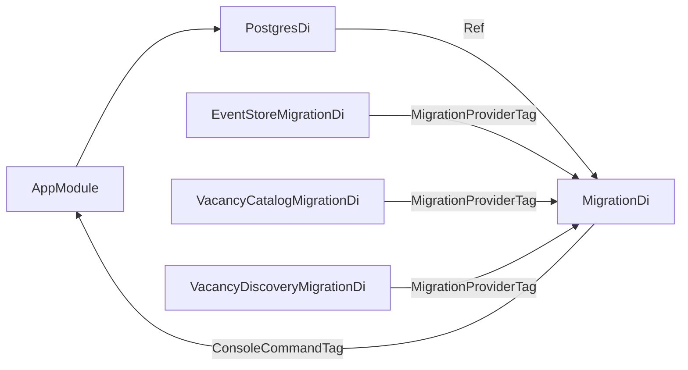

# Консоль приложения

`AppModule` — единственный корневой модуль композиции. Он импортирует контекстные `*Di` и передаёт между ними
только `Ref<T>` exports.

| Точка входа | Команда | Контекст | Назначение |
| --- | --- | --- |
| `../bin/app.php` | `migrate` | `MigrationDi` | Применяет миграции PostgreSQL. |
| `../bin/app.php` | `daemon:vacancy-discovery` | `VacancyDiscoveryDaemonDi` | Периодически получает вакансии и публикует события. |
| `../bin/app.php` | `serve:http` | `HttpDi` | Запускает HTTP-сервер каталога вакансий. |

## Композиция миграций

`AppModule` передаёт фабрики окружения в контексты. Значения читаются при запуске соответствующей команды, поэтому
`bin/app.php list` не требует конфигурации PostgreSQL, HTTP-сервера или Habr Career.
Причины и альтернативы зафиксированы в [ADR 0001](../../docs/adr/0001-edinyy-konsolnyy-vkhod.md).

Контексты помечают команды `Core\Presentation\Config\ConsoleCommandTag`. `AppModule` собирает их через
`Dic::taggedList()`, поэтому новый контекст добавляет команду без изменения корневого модуля.

## Runtime-процессы

`VacancyDiscoveryDaemonDi` собирает общий пул PostgreSQL, логирование, `EventStoreDi`, `EventBusDi`,
`VacancyCatalogEventSubscriberDi`, Habr Career и `VacancyDiscoveryDi`. Он возвращает
`Ref<DiscoverVacanciesDaemon>` для запуска периодического поиска вакансий.

`HttpDi` собирает общий пул PostgreSQL, логирование, HTTP-сервер и маршрутизаторы, зарегистрированные через
`HttpRouteTag`. Сейчас HTTP-входы добавляет `VacancyCatalogHttpDi`. Модуль возвращает `Ref<ServerHttp>`.

EventBus добавляет событие в EventStore до запуска обработчиков. In-memory доставка не переживает рестарт процесса.

## Правило изменения композиции

При добавлении модуля не передавайте его Infrastructure-объекты напрямую. Модуль должен экспортировать `Ref` на
Domain-контракт, а `AppModule` передаёт эту ссылку следующему потребителю.
Одновременно обновляйте этот документ и README соответствующего модуля.
