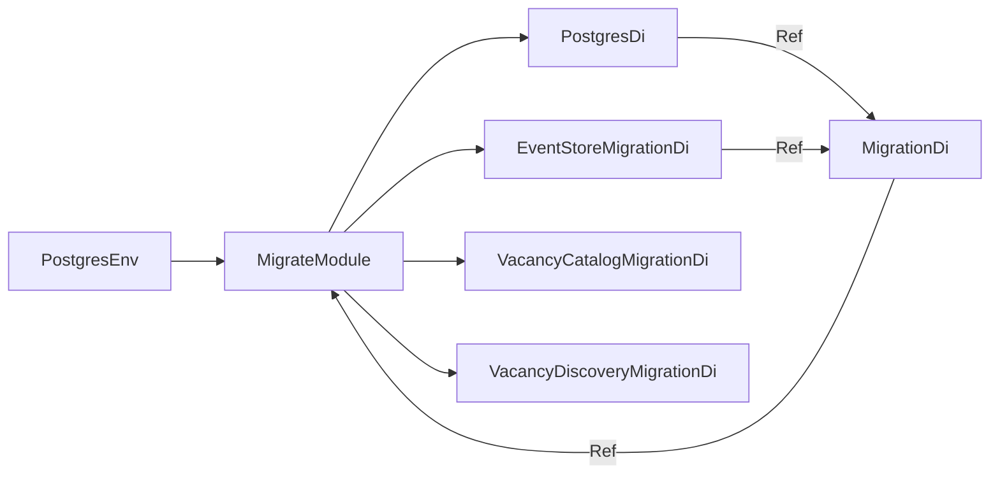

# Корневые модули композиции

Каждая точка входа собирает только зависимости своего процесса через отдельный корневой модуль композиции. Корневые модули
не создают подключения или адаптеры напрямую: импортируют технические и прикладные модули и передают между ними
только `Ref<T>` exports.

| Точка входа | Корневой модуль | Назначение |
| --- | --- | --- |
| `backend/bin/migrate.php` | `MigrateModule` | Применяет миграции PostgreSQL. |
| `backend/bin/vacancy-discovery-daemon.php` | `VacancyDiscoveryDaemonModule` | Периодически получает вакансии и публикует события. |
| `backend/bin/http.php` | `HttpModule` | Запускает HTTP-сервер каталога вакансий. |

## Композиция миграций

Порядок сборки в `MigrateModule::configure()`:

1. `PostgresDi` создаёт общий async pool PostgreSQL и экспортирует `Ref<PostgresDatabase>`.
2. `EventStoreMigrationDi` экспортирует `Ref<MigrationProvider>` с миграцией таблицы журнала событий.
3. `VacancyCatalogMigrationDi` и `VacancyDiscoveryMigrationDi` экспортируют миграции прикладных модулей.
4. `MigrationDi` получает PostgreSQL и все `Ref<MigrationProvider>`, затем возвращает `Ref<MigrateCommand>`.

`backend/bin/migrate.php` создаёт `PostgresEnv` из окружения, передаёт его
в `MigrateModule` и запускает экспортированный `MigrateCommand`.

## Runtime-процессы

`VacancyDiscoveryDaemonModule` собирает общий пул PostgreSQL, логирование, `EventStoreDi`, `EventBusDi`,
`VacancyCatalogEventSubscriberDi`, Habr Career и `VacancyDiscoveryDi`. Он возвращает
`Ref<DiscoverVacanciesDaemon>` для запуска периодического поиска вакансий.

`HttpModule` собирает общий пул PostgreSQL, логирование, HTTP-сервер и маршрутизаторы, зарегистрированные через
`HttpRouteTag`. Сейчас HTTP-входы добавляет `VacancyCatalogHttpDi`. Модуль возвращает `Ref<ServerHttp>`.

EventBus добавляет событие в EventStore до запуска обработчиков. In-memory доставка не переживает рестарт процесса.

## Правило изменения композиции

При добавлении модуля не передавайте его Infrastructure-объекты напрямую. Модуль должен экспортировать `Ref` на
Domain-контракт, а корневой модуль соответствующей точки входа передаёт эту ссылку следующему потребителю.
Одновременно обновляйте этот документ и README соответствующего модуля.
