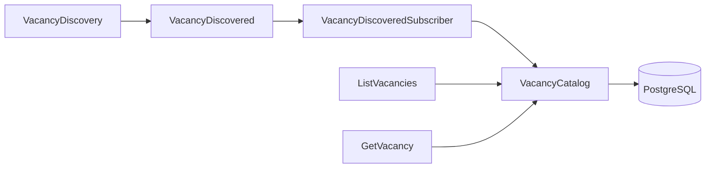

# Модуль VacancyCatalog

`VacancyCatalog` владеет пользовательской PostgreSQL-проекцией вакансий. Он получает новые вакансии из
`VacancyDiscovery` через событие `VacancyDiscovered`, сохраняет данные для списка и карточки, а также предоставляет
сценарии чтения.

## Архитектура и структура модуля

```text
VacancyCatalog/
├── Application/UseCase/
│   ├── GetVacancy.php
│   └── ListVacancies.php
├── Domain/
│   ├── Dto/
│   │   ├── Vacancy.php
│   │   └── VacancyListItem.php
│   └── VacancyCatalog.php
├── Infrastructure/
│   ├── PostgresVacancyCatalog.php
│   └── VacancyCatalogMigrationProvider.php
├── Presentation/
│   ├── Config/
│   │   ├── VacancyCatalogEventSubscriberDi.php
│   │   ├── VacancyCatalogHttpDi.php
│   │   ├── VacancyCatalogMigrationDi.php
│   │   └── VacancyCatalogRoutes.php
│   ├── Http/
│   │   ├── Controller/
│   │   │   ├── GetVacancyController.php
│   │   │   └── ListVacanciesController.php
│   │   └── View/
│   │       ├── Template/
│   │       │   ├── layout.php
│   │       │   ├── list.php
│   │       │   ├── not-found.php
│   │       │   └── vacancy.php
│   │       └── VacancyCatalogView.php
│   └── Listener/VacancyDiscoveredSubscriber.php
└── README.md
```



`Domain` публикует модель проекции и контракт хранилища. 
`Application` реализует сценарии чтения. 
`Infrastructure` содержит PostgreSQL-адаптер и provider миграции.
`Presentation` регистрирует зависимости, обрабатывает событие другого модуля и предоставляет HTTP-входы чтения.

## Предметная область

- `Vacancy` содержит полные данные карточки: источник, внешний идентификатор, заголовок, URL, работодателя,
  локацию, описание и дополнительные JSON-совместимые сведения.
- `VacancyListItem` содержит данные, необходимые для списка: источник, внешний идентификатор, заголовок, URL,
  работодателя, локацию и зарплату.
- `VacancyCatalog` определяет сохранение `ExternalVacancy`, получение списка и карточки по
  `ExternalVacancyId`. Внешний идентификатор является парой `source` и `externalVacancyId`.

Модуль использует опубликованные типы `ExternalVacancy`, `ExternalVacancyId` и событие `VacancyDiscovered` из
`VacancyDiscovery\Domain`. Синхронного вызова внутренностей `VacancyDiscovery` нет.

## Бизнес-логика

`ListVacancies` возвращает все элементы пользовательской проекции в порядке `source`, затем
`externalVacancyId`.

`GetVacancy` получает `ExternalVacancyId` и возвращает полную карточку либо `null`, если вакансия не найдена.

## Точки входа

`VacancyDiscoveredSubscriber` реализует `EventSubscriber`, подписывается на `VacancyDiscovered` и передаёт
вакансию в `VacancyCatalog::add()`.

В `VacancyDiscoveryDaemonModule` subscriber передаётся в `EventBusDi`. 
Поэтому в runtime опубликованное `VacancyDiscovered` доставляется в каталог через `EventBus`.

`VacancyCatalogHttpDi` создаёт use cases чтения, контроллеры, HTML-представление `VacancyCatalogView` и
`VacancyCatalogRoutes`. Последний реализует `RouteRegister` и помечается `HttpRouteTag`. `HttpModule` собирает
tagged registrars в общий `Router`; точка входа `bin/http.php` запускает сервер.

| Маршрут | Статус | Ответ |
| --- | --- | --- |
| `GET /vacancies` | `200` | HTML-список с заголовком, работодателем, локацией, зарплатой и ссылками на карточки |
| `GET /vacancies` | `200` | При отсутствии записей содержит текст «Вакансии не найдены» |
| `GET /vacancies/{source}/{externalVacancyId}` | `200` | HTML-карточка с основными полями, первоисточником, описанием, дополнительными сведениями и ссылкой на список |
| `GET /vacancies/{source}/{externalVacancyId}` | `404` | HTML-страница с текстом «Вакансия не найдена» и ссылкой на список |

`VacancyCatalogView` рендерит нативные PHP-шаблоны. Он передаёт дочерний шаблон в буфер, помещает результат в
`layout.php` и передаёт шаблонам только явно заданные Domain DTO и callback-функции операций представления. Шаблоны
не имеют доступа к экземпляру view.

Текст и атрибуты из внешних источников экранируются в шаблонах. Ссылкой на первоисточник может быть только
абсолютный URL со схемой `http` или `https`; при недопустимом URL карточка показывает «Первоисточник недоступен»
без ссылки.

## Инфраструктура

`PostgresVacancyCatalog` реализует Domain-контракт через `Platform\Postgres\Domain\PostgresExecutor`.
Он сохраняет проекцию в таблицу `vacancy_catalog_vacancies`:

- первичный ключ: `source`, `external_vacancy_id`;
- поля списка и карточки хранятся отдельными колонками;
- дополнительные сведения сохраняются в `details` типа `JSONB`.

Повторная доставка события не создаёт вторую запись и не перезаписывает сохранённую проекцию: вставка использует
`ON CONFLICT (source, external_vacancy_id) DO NOTHING`.

`VacancyCatalogMigrationProvider` публикует миграцию `vacancy_catalog_001_create_vacancies`.
`VacancyCatalogMigrationDi` передаёт её в общий `MigrateModule`.

## Зависимости и конфигурация

`VacancyCatalogHttpDi` принимает `Ref<PostgresDatabase>` и регистрирует только зависимости HTTP-входов. Его export
реализует `RouteRegister` и собирается HTTP-платформой по `HttpRouteTag`.

`VacancyCatalogEventSubscriberDi` принимает тот же `Ref<PostgresDatabase>` и экспортирует только
`Ref<EventSubscriber>` для `VacancyDiscoveryDaemonModule`. В каждом entry point создаётся отдельный
`PostgresVacancyCatalog`, поэтому конфигурации не передают между собой use cases или контроллеры.

Модуль использует:

- `Platform\Postgres` для доступа к PostgreSQL;
- `Platform\Migration` для применения миграции;
- `Platform\EventBus` для доставки Domain-события;
- `thesis/dic` для регистрации зависимостей.

Собственных переменных окружения у модуля нет. Конфигурацию подключения к PostgreSQL предоставляет
`Platform\Postgres`.

## Тестирование

Тесты расположены в `backend/tests/Suite/VacancyCatalog/`:

- unit-тесты use cases проверяют делегирование чтения в `VacancyCatalog`;
- unit-тест subscriber проверяет передачу вакансии из `VacancyDiscovered` в каталог;
- integration-тест PostgreSQL-адаптера проверяет сохранение, чтение и идемпотентность вставки;
- integration-тест миграции проверяет наличие таблицы пользовательской проекции.
- integration-тест HTTP проверяет HTML-список, карточку, отсутствие вакансий и зарплаты, экранирование данных,
  небезопасный URL первоисточника и HTML `404` через PostgreSQL.

## Ограничения

- Список не поддерживает фильтрацию, лимит или пагинацию.
- HTTP-слой не содержит аутентификации, middleware, versioning API и собственного CSS.
- Layout и механизм рендеринга ограничены `VacancyCatalog/Presentation/Http/View`. Общий компонент допускается
  выделить в `Core` только после появления второго HTTP-модуля с такой потребностью.
- Layout ограничен `lang="ru"`, UTF-8, `title` и содержимым страницы. Пустые описание и дополнительные сведения не
  выводятся, а отсутствующие работодатель и локация показываются как «Не указано».
- Доставка определяется текущим `InMemoryEventBus`: она process-local и best-effort; сохранённое до аварии,
  но не доставленное событие автоматически не обрабатывается после рестарта.
