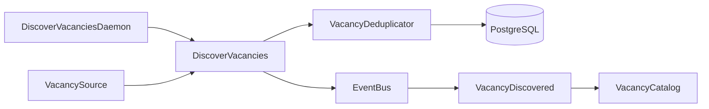

# Модуль VacancyDiscovery

`VacancyDiscovery` получает вакансии из внешних источников, исключает уже обнаруженные и публикует событие
`VacancyDiscovered` для каждой новой вакансии. 
Сейчас в runtime подключён Habr Career; хранение пользовательской проекции выполняет другой модуль, `VacancyCatalog`.

## Архитектура и структура модуля

```text
VacancyDiscovery/
├── Application/UseCase/DiscoverVacancies.php
├── Domain/
│   ├── Dto/ExternalVacancy.php
│   ├── Event/VacancyDiscovered.php
│   ├── ExternalVacancyId.php
│   ├── VacancyDeduplicator.php
│   └── VacancySource.php
├── Infrastructure/
│   ├── HabrCareer/
│   ├── PostgresVacancyDeduplicator.php
│   └── VacancyDiscoveryMigrationProvider.php
└── Presentation/
    ├── Config/
    └── Console/DiscoverVacanciesDaemon.php
```



`Presentation` собирает зависимости и запускает периодический поиск. 
`Application` координирует источники, дедупликацию и публикацию событий. 
`Domain` публикует типы и контракты модуля. 
`Infrastructure` содержит адаптер источника Habr Career и реализацию дедупликации в PostgreSQL.

## Предметная область (Domain)

- `ExternalVacancy` -- неизменяемый DTO внешней вакансии. Содержит источник, внешний идентификатор, заголовок,
  URL, опциональные работодателя, локацию, описание и произвольные дополнительные данные. `payload()` возвращает
  JSON-совместимое представление для потребителей события.
- `ExternalVacancyId` -- неизменяемая пара `source` и `externalVacancyId`. Оба значения не могут быть пустыми.
  Именно эта пара определяет уникальность вакансии между источниками.
- `VacancySource` -- контракт источника. Его `vacancies()` возвращает итерируемый набор `ExternalVacancy` и
  принимает необязательную `Amp\Cancellation`.
- `VacancyDeduplicator` -- контракт атомарной регистрации `ExternalVacancyId`; `true` означает новую пару
  идентификаторов.
- `VacancyDiscovered` -- Domain-событие, содержащее `ExternalVacancy`. Имя его потока имеет вид
  `vacancy:{source}:{externalVacancyId}`, а payload совпадает с `ExternalVacancy::payload()`.

`VacancyCatalog` использует опубликованные `ExternalVacancy`, `ExternalVacancyId` и `VacancyDiscovered` для
построения пользовательской проекции. В runtime `VacancyDiscoveredSubscriber` сохраняет полученную вакансию в
каталог.

## Бизнес-логика (Application)

`DiscoverVacancies` принимает список `VacancySource`, `VacancyDeduplicator`, `EventBus` и logger. Для каждой
полученной вакансии use case сначала регистрирует составной идентификатор, а затем публикует
`VacancyDiscovered`, только если регистрация вернула `true`.

Источники выполняются конкурентно группами до трёх. Ошибка одного источника записывается в logger после
завершения его группы и не отменяет остальные источники этой группы. 
Отмена передаётся источникам; после её запроса новые группы не запускаются.

## Точки входа (Presentation)

HTTP-входы и маршруты в модуле отсутствуют.

`DiscoverVacanciesDaemon` -- консольная точка входа периодического поиска. Он запускает use case, ожидает
600 секунд и повторяет цикл. `SIGINT` и `SIGTERM` отменяют дальнейшее ожидание и завершают daemon с кодом `0`.
Необработанная ошибка всего цикла записывается в logger, после чего daemon продолжает работу.

Скрипт `backend/bin/vacancy-discovery-daemon.php` собирает daemon через `VacancyDiscoveryDaemonModule`.
Этот composition root подключает PostgreSQL, журнал и шину событий, логирование, `VacancyCatalog` как
подписчика и источник Habr Career.

Каждый подключённый source-модуль помечает свою реализацию `VacancySource` тегом `VacancySourceTag`.
`VacancyDiscoveryDi` собирает помеченные источники через `Dic::taggedList()`. Чтобы подключить новый источник,
его модуль нужно импортировать в `VacancyDiscoveryDaemonModule` до импорта `VacancyDiscoveryDi` и пометить
экспортируемый `VacancySource` этим тегом.

## Инфраструктура

`PostgresVacancyDeduplicator` реализует `VacancyDeduplicator` атомарной SQL-вставкой в
`vacancy_discovery_seen_vacancies`. Первичная пара ключей `(source, external_vacancy_id)` и
`ON CONFLICT DO NOTHING` обеспечивают дедупликацию между запусками и источниками.

`VacancyDiscoveryMigrationProvider` экспортирует миграцию `vacancy_discovery_001_create_seen_vacancies`. 
Она импортируется корневым `MigrateModule`.

`HabrCareerVacancySource` реализует `VacancySource` через `amphp/http-client`:

- запрашивает первую страницу PHP-вакансий Habr Career, отсортированную по дате;
- передаёт сессионную cookie в заголовке `Cookie`;
- устанавливает трёхсекундные таймауты подключения, TLS, передачи и неактивности;
- отклоняет не-2xx ответ и оборачивает ошибки HTTP-клиента или чтения потока в `RuntimeException`;
- передаёт успешный HTML в `HabrCareerVacancyParser`.

`HabrCareerVacancyParser` извлекает карточки вакансий из HTML первой страницы. 
Для каждой карточки он заполняет источник `career.habr.com`, идентификатор, заголовок, URL, работодателя, локацию, 
а в `details` -- дату публикации, зарплату и навыки. Неожиданная страница без списка вакансий считается ошибкой разбора.

## Зависимости и конфигурация

Модуль использует `amphp/amp` для конкурентного запуска и отмены, `amphp/http-client` для Habr Career,
`amphp/postgres` через контракт `Platform\Postgres\Domain\PostgresDatabase` и `thesis/dic` для DI.
Публикация событий выполняется через `Platform\EventBus\Domain\EventBus`; EventBus сохраняет события в
`EventStore` до запуска подписчиков.

`HABR_CAREER_COOKIE` задаётся в корневом `.env` по шаблону `.env.dist` и обязателен для запуска daemon.
Это cookie сессии Habr Career, поэтому значение не следует добавлять в исходный код, документацию или логи.
Подключение к PostgreSQL получает конфигурацию из модуля `Platform/Postgres`.

## Тестирование

Тесты модуля расположены в `backend/tests/Suite/VacancyDiscovery/`:

- `Application/UseCase/DiscoverVacanciesTest.php` проверяет дедупликацию, публикацию событий, отмену,
  конкурентный запуск и обработку ошибок источников;
- `Domain/ExternalVacancyIdTest.php` проверяет непустые компоненты внешнего идентификатора;
- `Infrastructure/HabrCareer/` проверяет разбор HTML, сетевые ошибки, отмену и параметры HTTP-запроса;
- `Infrastructure/PostgresVacancyDeduplicatorTest.php` проверяет PostgreSQL-дедупликацию.

## Ограничения

- В runtime подключён только Habr Career; абстракция `VacancySource` допускает дополнительные источники.
- Адаптер Habr Career читает только первую страницу выдачи PHP-вакансий и не запрашивает детальную страницу
  вакансии.
- Отбор подходящих вакансий в модуле не реализован: все вакансии, возвращённые источником, проходят
  дедупликацию и публикуются как новые.
- Доставка событий определяется текущей реализацией `EventBus`: она process-local и best-effort.
